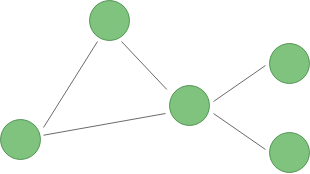

# Ataraxia

[](https://badge.fury.io/js/ataraxia)

<p align="center">
  
</p>

Mesh networking with peer-to-peer messaging for NodeJS and the browser.
Ataraxia connects different instances together and allows messages to be passed
between these instances. Some instances may act as routers for other instances
to create a mesh network.

Ataraxia is split into several projects:

* [ataraxia](packages/core) is the main library that provides the messaging functionality
* [ataraxia-local](packages/local) provides a machine-local transport
* [ataraxia-tcp](packages/tcp) provides a TCP-based transport with local network discovery
* [ataraxia-ws-client](packages/ws-client) provides a websocket client
* [ataraxia-ws-server](packages/ws-server) provides a websocket server
* [ataraxia-services](packages/services) provides easy-to-use services with RPC and events

## Features

* Instances can send and receive messages from other instances
* Partially connected mesh network, messages will be routed to their target
* Authentication support, anonymous and shared secret authentication available in core
* RPC support via [ataraxia-services](https://github.com/aholstenson/ataraxia/tree/master/packages/services) that lets you call methods and receive events from services registered anywhere in the network
* Support for different transports
  * [ataraxia-local](https://github.com/aholstenson/ataraxia/tree/master/packages/local) provides a machine-local transport
  * [ataraxia-tcp](https://github.com/aholstenson/ataraxia/tree/master/packages/tcp) provides a TCP-based transport with customizable discovery of peers and TLS encryption
  * [ataraxia-ws-client](https://github.com/aholstenson/ataraxia/tree/master/packages/ws-client) and [ataraxia-ws-server](https://github.com/aholstenson/ataraxia/tree/master/packages/ws-server) for websockets

## Example with TCP transport

```javascript
import { Network, AnonymousAuth } from 'ataraxia';
import { TCPTransport, TCPPeerMDNSDiscovery } from 'ataraxia-tcp';

// Setup a network with a TCP transport
const net = new Network({
  name: 'name-of-your-app-or-network',
  
  transports: [

    new TCPTransport({
      // Discover peers using mDNS
      discovery: new TCPPeerMDNSDiscovery(),

      // Setup anonymous authentication
      authentication: [
        new AnonymousAuth()
      ]
    })
  
  ]
});

net.onNodeAvailable(node => {
  console.log('A new node is available:', node.id);
  node.send('hello');
});

net.onMessage(msg => {
  console.log('A message was received', msg.type, 'with data', msg.data, 'from', msg.source.id);
});

// Start the network
await net.start();
```

## Example with machine-local transport and TCP transport

This example creates a network where instances on the same machine connect to
each other locally first and then elects one instance to handle connections
to other machines on the same network.

```javascript
import { Network, AnonymousAuth } from 'ataraxia';
import { TCPTransport, TCPPeerMDNSDiscovery } from 'ataraxia-tcp';
import { MachineLocalTransport } from 'ataraxia-local';

// Setup a network
const net = new Network({
  name: 'name-of-your-app-or-network'
});

net.addTransport(new MachineLocalTransport([
  onLeader: () => {
    /*
    * The leader event is emitted when this instance becomes the leader
    * of the machine-local network. This instance will now handle
    * connections to other machines in the network.
    */
    net.addTransport(new TCPTransport({
      discovery: new TCPPeerMDNSDiscovery(),

      authentication: [
        new AnonymousAuth()
      ]
    }));
  }
]);

await net.start();
```

## Support for services

Services are supported via `ataraxia-services`, where objects can be registered
and functions on them called remotely:

```javascript
import { Services } from 'ataraxia-services';

const net = ... // setup network with at least one transport

const services = new Services(net);

services.onAvailable(service => console.log(service.id, 'is now available'));
services.onUnavailable(service => console.log(service.id, 'is no longer available'));

// Start the network
await net.start();

// Start the services on top of the network
await services.start();

// Register a service as a plain object
const handle = services.register({
  id: 'service-id',
  
  hello() {
    return 'Hello world';
  }
});
```
